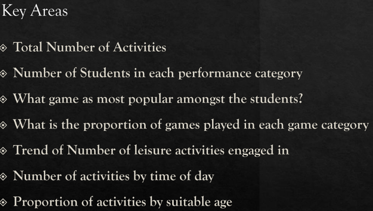

# KingsGuard-Group-of-schools-analysis-on-students-patterns-and-behaviour-during-leisure-

## DISCLAIMER:
All dataset and reports do not represent any school,institution or country but just a dummy dataset to demostrate capabilities of tableau

## INTRODUCTION:

 ## PROBLEM STATEMENT:
 KingsGuard seeks expertise to unlock valuable insights hidden within their datasets on how to understand and leverage patterns and behaviours of students' during leisure time such as:
 - Identifying meaningful pattern
 - Enhancing learning experience
 - Maximizing students performance
 - Promote a class leading educational environment

   ## SKILLS AND CONCEPTS DEMOSTRATED:
 - Data Connection and Preparation
 - Drag-and-Drop Interface
 - Dimensions and Measures
 - Calculated Fields
 - Visualizations
 - Filters
 - Aggregations
 - Parameters
 - Dashboards
 - Trend Lines
 - Storytelling
 - Publishing and Sharing

   ## ANALYSIS:
  The report consists of:

  
 

   ## VISUAUALISATION:
   

