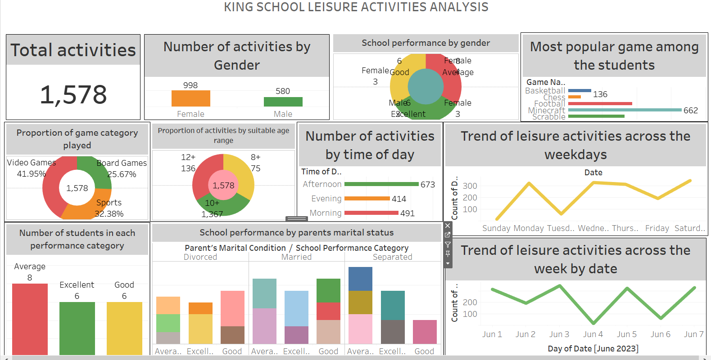

# KingsGuard-Group-of-schools-analysis-on-students-patterns-and-behaviour-during-leisure-

## DISCLAIMER:
All dataset and reports do not represent any school,institution or country but just a dummy dataset to demostrate capabilities of tableau

## INTRODUCTION:

 ## PROBLEM STATEMENT:
 KingsGuard seeks expertise to unlock valuable insights hidden within their datasets on how to understand and leverage patterns and behaviours of students' during leisure time such as:
 - Identifying meaningful pattern
 - Enhancing learning experience
 - Maximizing students performance
 - Promote a class leading educational environment

   ## SKILLS AND CONCEPTS DEMOSTRATED:
 - Data Connection and Preparation
 - Drag-and-Drop Interface
 - Dimensions and Measures
 - Calculated Fields
 - Visualizations
 - Filters
 - Aggregations
 - Parameters
 - Dashboards
 - Trend Lines
 - Storytelling
 - Publishing and Sharing

   ## ANALYSIS:
  The report consists of:

  
 

   ## VISUAUALISATION:

   ### To interact with the dashboard click  [here](https://lnkd.in/eDzg-fMN)

   

  
  - Total activities 1578
  - Number of activities by gender:female 998,male 580
  - School performance by gender:
    
                                    female                                   |              male
            -------------------------------------------------------------------------------------------------------------
                         -Excellent 3                                        |                 3
                         -Average   4                                        |                 4
                         -Good      3                                        |                 3

 - most popular games among the students:
      
      -basketbal 136
      
      -chess  75
      
      -football  375
      
      -minecraft  662
      
      -scrabble  330
      

 - proportion of games played:
     
    -videogames 41.95%
   
    -board games  25.69%
   
    -sports  32.38%  and so on.

   ## Insights:
   

                                female                                 |                    male
                                                                                    
                  ---------------------------------------------------------------------------------------------------------------
              -count of activities is 998                              |             count of activities is 580
   
              -count of games:                                         |
                               basketball  72                          |           count of games basketball is  64
                               chess   48                              |                    chess    27
                               football 286                            |                    football  89
                               minecraft 434                           |                     minecraft 228
                               scrabble 434                            |                     scrabble    172
              -propo. of game category played:                         |
   
                     video games 43.49%  of 998                        |                    video games   39.31% of 580       
                     board games 20.64%                                |                     board games   34.31%  
                    sports     35.87%                                  |                      sports         26.38%
              -school performance

                   good 3                                              |                       good  3                                                   
                   average 4                                           |                       average   4
                  excellent 3                                          |                       excellent  3
   
   

   
